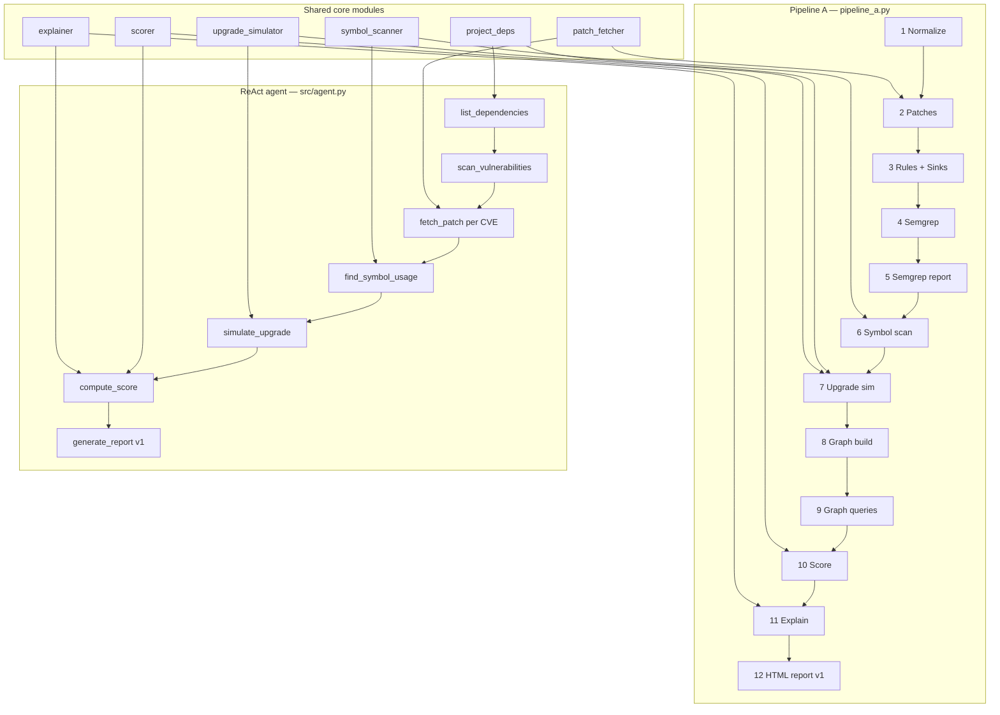
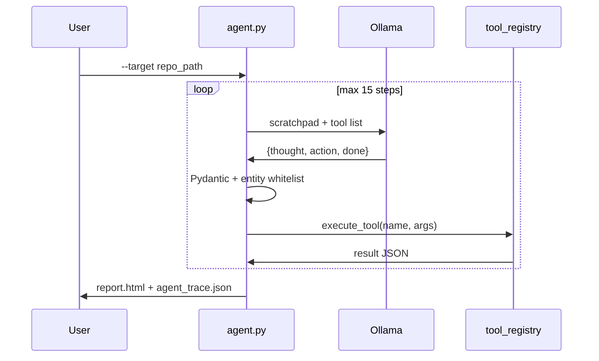
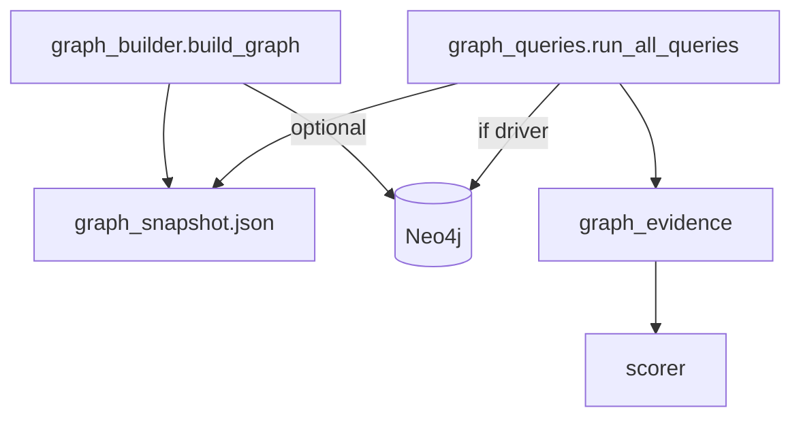

# Architecture

This document describes how the **Predictive Risk Assessment System** is structured today, what each pipeline does, where data flows, and known gaps the team should be aware of.

For setup and commands, see [README.md](README.md). For pending work, see [TODO.md](TODO.md).

---

## System overview

The repo implements **pre-upgrade risk analysis** for Python projects in two complementary modes:

| Mode | Entry point | Orchestration | Best for |
|------|-------------|---------------|----------|
| **Pipeline A** | `pipeline_a.py` | Fixed 12-phase script | Full analysis: Semgrep, graph, batch patches, presentation output |
| **ReAct agent** | `python -m src.agent` | LLM plans tool calls (Ollama) | Interactive investigation of any repo; falls back to scripted order |

Both paths share core modules under `src/` but **do not run the same phases**. Scores are always computed by the deterministic scorer (`src/scorer.py`); the LLM never chooses PROCEED / REVIEW / BLOCK.



---

## Pipeline A (deterministic orchestrator)

**File:** `pipeline_a.py`  
**Sample target:** `vulnerable-task-tracker/`  
**Output directory:** `--output-dir` (default: cwd)

### Phase diagram

```mermaid
flowchart LR
  Trivy[Trivy JSON] --> N[normalizer]
  N --> F[families]
  F --> PF[patch_fetcher batch]
  PF --> RR[rule_resolver]
  RR --> SR[symbol_rule_builder]
  SR --> EX[executor Semgrep]
  EX --> RP[reporter]
  RP --> SYM[symbol_scanner]
  SYM --> UP[upgrade_simulator]
  UP --> GB[graph_builder]
  GB --> GQ[graph_queries]
  GQ --> SC[scorer]
  SC --> EXPL[explainer]
  EXPL --> HTML[html_reporter v1]
```



### Phase reference

| Phase | Module | Input | Output |
|-------|--------|-------|--------|
| **Preflight** | `tool_registry.run_trivy_on_repo` | `--project-dir` | `enriched_trivy_output.json` (if `--input` missing) |
| **1** | `normalizer.py` | Trivy JSON | In-memory **CWE families** |
| **2** | `patch_fetcher.py` | CVE list | `patches.json` (+ cache in `data/patches/`) |
| **3** | `rule_resolver.py`, `registry_matcher.py`, `symbol_rule_builder.py` | Families + patches | `{output_dir}/semgrep_rules/*.yaml` |
| **4** | `executor.py` | Resolved rules | In-memory Semgrep matches |
| **5** | `reporter.py` | Matches | `pipeline_a_report.json` |
| **6** | `symbol_scanner.py` | Patches + project AST | `symbol_scan.json` |
| **7** | `upgrade_simulator.py`, `project_deps.py` | Reachable CVEs + pins | `upgrade_simulation.json` |
| **8** | `graph_builder.py`, `static_analyzer.py` | Trivy, Semgrep, `services.yaml` | `graph_snapshot.json` (+ optional Neo4j upsert) |
| **9** | `graph_queries.py` | Graph snapshot / Neo4j | In-memory `graph_evidence` |
| **—** | `pipeline_a._merge_symbol_reachability` | Symbol + graph | Merged reachability for scorer |
| **10** | `scorer.py` | Trivy + graph evidence | `risk_assessment.json` |
| **11** | `explainer.py` | Assessment | `explanations.json` |
| **12** | `html_reporter.py` | All JSON artifacts | `risk_report.html` |

### Rule resolution (Phase 3)

Rules are resolved **without frozen demo overlays**:

1. **Cache** — `data/rules_db.json` + on-disk YAML (validated with `semgrep --validate`)
2. **Registry** — official Semgrep rules indexed by CWE (`registry_matcher.py`)
3. **LLM** — Ollama or Gemini generates YAML (optional; skip with `--skip-llm`)
4. **Symbol sinks** — `symbol_rule_builder.py` overwrites/adds patch-aware rules (e.g. `yaml.load`, `Image.open`)

### Terminal UI

`src/pipeline_console.py` (Rich) renders banners, phase rules, colored tables, and an executive summary. Use `--present` (`--quiet --no-graph`) for demo-style output.

### CLI flags (architecture-relevant)

| Flag | Effect |
|------|--------|
| `--no-graph` / `--present` | Skips phases 8–9 |
| `--neo4j` | Uses Bolt driver for Phase 9 queries (Phase 8 always attempts upsert when graph runs) |
| `--skip-llm` | Phase 3 uses cache + registry + symbol sinks only |
| `--offline` | Inlines vendor JS/CSS in HTML report |

---

## ReAct agent (LLM orchestrator)

**File:** `src/agent.py`  
**Prompt:** `src/agent_prompt.py`  
**Tools:** `src/tool_registry.py`

### Control flow



### Whitelisted tools

| Tool | Module used | Notes |
|------|-------------|-------|
| `list_dependencies` | `project_deps.discover_dependency_pins` | requirements.txt / pyproject / Pipfile |
| `scan_vulnerabilities` | `tool_registry.run_trivy_on_repo` | Requires Trivy on PATH |
| `fetch_patch` | `patch_fetcher.fetch_patch` | One CVE per call (not batch) |
| `find_symbol_usage` | `symbol_scanner.scan_symbols` | Python AST only |
| `simulate_upgrade` | `upgrade_simulator.simulate_upgrade` | Single package bump |
| `compute_score` | `scorer.score_cves` + `explainer.explain_risk` | Deterministic verdict |
| `generate_report` | `html_reporter.build_report_data` | **v1 report only** |
| `finish` | — | Ends loop |

### Guardrails

- Fixed tool whitelist (`ALLOWED_TOOLS`)
- Pydantic schema on every LLM response
- CVE/package strings must appear in scratchpad (entity whitelist)
- 60s timeout per tool; 30s per LLM call
- **Fallback:** `--no-llm`, Ollama down, or repeated invalid JSON → `scripted_fallback()` (same tools, fixed order)

### Agent artifacts

| File | Description |
|------|-------------|
| `data/agent_trace.json` | Full step trace + `collected_data` (gitignored) |
| `{output_dir}/report.html` | HTML report (agent default name) |

---

## HTML reports

| Version | Module | Template | Tabs | Wired in production? |
|---------|--------|----------|------|----------------------|
| **v1** | `html_reporter.py` | `templates/report.html.j2` | 5 (Executive, Technical, Patches, Upgrade, Graph) | **Yes** — Pipeline A + agent |
| **v2** | `html_reporter_v2.py` | `templates/report_v2.html.j2` | 6 (+ Fix Plan, Audit) | **No** — tests + `assemble_sample_report()` only |

Both expose the same `render_html(assessment, explanations, graph_meta, output_dir, ...)` contract. v2 adds `fix_plan`, `conflicts`, `cascade`, `audit`, and richer metadata.

**Integration path (see [TODO.md](TODO.md)):** swap imports in `pipeline_a.py` and `tool_registry.py`, add `--report-version v2`, run `tests/test_html_reporter_v2.py`.

---

## Knowledge graph & Neo4j

### Components

| File | Role |
|------|------|
| `docker-compose.yml` | Neo4j 5 Community on `7474` (browser) / `7687` (Bolt) |
| `graph_builder.py` | Builds in-memory graph from Trivy, deps, AST calls, `services.yaml`, Semgrep hits; writes `graph_snapshot.json`; **MERGE upsert to Neo4j** (clears DB each run) |
| `graph_queries.py` | Cypher reachability / blast radius when driver connected; else BFS on JSON snapshot |
| `services.yaml` | Manual Flask/Django entry points for route → handler mapping |

### Environment

```env
NEO4J_URI=bolt://localhost:7687
NEO4J_USER=neo4j
NEO4J_PASSWORD=demo-password
```

Install driver: `pip install -r requirements-graph.txt`

### Current behavior

- Graph phases run unless `--no-graph` or `--present`
- Phase 8 **always attempts** Neo4j upsert when graph is enabled; failure is non-fatal (snapshot fallback)
- `--neo4j` ensures Phase 9 uses Bolt for queries
- **Agent does not use the graph** today
- HTML reports build a **simplified CVE graph** from symbol scan data; they do not load `graph_snapshot.json` yet



---

## Caching & offline data

| Store | Path | Used by |
|-------|------|---------|
| Patch cache | `data/patches/{CVE}.json` | patch_fetcher, symbol scanner |
| deps.dev graphs | `data/depsdev/PyPI/` | upgrade_simulator |
| OSV snapshots | `data/osv/` | upgrade conflict class D |
| EPSS / KEV | `data/epss_snapshot.json`, `data/kev_snapshot.json` | scorer |
| Rule cache | `data/rules_db.json` | rule_resolver |
| Semgrep registry index | `data/cwe_rule_map.json` | registry_matcher |

Populate deps.dev cache: `python scripts/populate_depsdev_cache.py`

---

## Architecture review — what is correct vs gaps

### Correct / intentional

- **Separation of scoring and LLM** — verdict is always deterministic
- **Patch-aware symbols** — reachability targets maintainer fix sites, not generic CWE guesses
- **Offline-first caches** — patches and deps.dev ship pre-populated for the sample app
- **Neo4j optional** — pipeline completes with JSON snapshot only
- **Pipeline A is the “full” path** — Semgrep + graph + batch operations

### Gaps & inconsistencies (team should track)

| # | Issue | Impact | Tracked in TODO |
|---|-------|--------|-----------------|
| 1 | **HTML report v2 not wired** | Production still emits v1 | Yes — P0 |
| 2 | **Agent vs Pipeline A feature parity** | Agent has no Semgrep, graph, or batch patches | Yes |
| 3 | **Scoring reachability differs** | Agent uses symbol-only evidence; Pipeline A merges graph + symbol | Yes |
| 4 | **HTML ignores graph snapshot** | `render_html` passes `graph=None`; vis graph built from CVE list only | Yes |
| 5 | **Report filenames differ** | Pipeline → `risk_report.html`; agent → `report.html` | Yes |
| 6 | **Neo4j full DB clear each run** | Fine for dev; may need incremental upsert for shared instances | Yes |
| 7 | **Phase docstring numbering** | `graph_builder` / `graph_queries` comments say Phase 5–6; orchestrator uses 8–9 | Low |
| 8 | **`fetch_patches_batch` not an agent tool** | LLM must call `fetch_patch` per CVE (slow) | Yes |

---

## Directory map (source)

```
pipeline_a.py           12-phase orchestrator
src/
  agent.py              ReAct loop
  tool_registry.py      Agent tools + Trivy helper
  normalizer.py         Trivy → CWE families
  patch_fetcher.py      CVE → patch → symbols
  rule_resolver.py      Semgrep rule triple-check
  symbol_rule_builder.py Patch-aware sink rules
  executor.py           Parallel Semgrep
  symbol_scanner.py     AST reachability
  upgrade_simulator.py  deps.dev conflict prediction
  graph_builder.py      Knowledge graph ingest
  graph_queries.py      Reachability queries
  scorer.py             Deterministic risk score
  explainer.py          Template narratives
  html_reporter.py      Report v1
  html_reporter_v2.py   Report v2 (not wired)
  pipeline_console.py   Rich terminal UI
vulnerable-task-tracker/ Reference vulnerable Flask app
tests/fixtures/         Test inputs (moved from examples/)
templates/              Jinja HTML templates
data/                   Offline caches (patches, deps.dev, osv, epss)
```

---

## Recommended reading order

1. [README.md](README.md) — install and run Pipeline A on `vulnerable-task-tracker`
2. This file — understand both pipelines and gaps
3. [TODO.md](TODO.md) — pick up pending integration work
4. `pipeline_a.py` — phase wiring
5. `src/agent.py` + `src/tool_registry.py` — agent tools and guardrails
