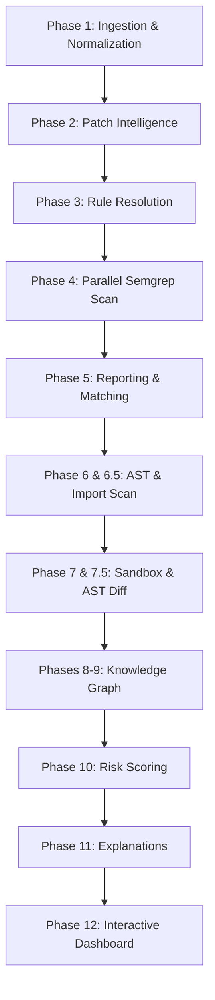

# Predictive Risk Assessment System

The **Predictive Risk Assessment System** is an advanced dependency security and upgrade triage pipeline. It combines static CVE scans, Abstract Syntax Tree (AST) reachability checkers, isolated sandbox package upgrades, breaking API change diffing, and automated code remediation into a unified developer dashboard.

---

## Quick Start

```powershell
# 1. Create and activate virtual environment
python -m venv venv
.\venv\Scripts\Activate.ps1

# 2. Install dependencies
pip install -r requirements.txt

# 3. (Optional) Install Neo4j graph requirements
pip install -r requirements-graph.txt

# 4. Run the demo scan on the bundled sample app
python pipeline_a.py `
  --project-dir ./vulnerable-task-tracker `
  --output-dir ./output `
  --skip-llm --present --offline
```

Open `output/risk_report.html` in a web browser to view the generated dashboard.

---

## Detailed Step-by-Step Pipeline Architecture

The system executes a **12-Phase Assessment Pipeline** to evaluate risk, verify reachability, simulate upgrades, and suggest code fixes. Here is what happens at each stage and why:



### Phase 1: Ingestion & Normalization (`src/normalizer.py`)
* **What happens:** Reads a Trivy JSON report (or executes a live CLI run using `trivy fs`). It parses and normalizes package names, CVSS scores, vectors, and CWE IDs, grouping them into logical CWE vulnerability families (e.g., `injection`, `buffer_overflow`, `resource_exhaustion`).
* **Why:** Ingestion normalizes raw scanner inputs so subsequent phases run on consistent data shapes. Grouping by CWE family maps individual vulnerabilities to general code patterns.

### Phase 2: Patch Intelligence (`src/patch_fetcher.py`)
* **What happens:** Retrieves security patches from vulnerability data sources (OSV, NVD, GitHub commits, etc.). It identifies files modified by the fix, line-level diffs, and compiles a list of **vulnerable symbols** (functions, methods, and classes affected by the bug).
* **Why:** Knowing exactly which functions were modified in a security patch allows the downstream reachability checker to determine if the application actually calls the vulnerable code.

### Phase 3: Triple-Check Rule Resolution (`src/rule_resolver.py` & `src/symbol_rule_builder.py`)
* **What happens:** Resolves Semgrep rules to scan the project codebase using a tiered lookup:
  1. **[A] Local Cache (`data/rules_db.json`)**: Reuses previously resolved rules.
  2. **[B] Official Semgrep Registry**: Matches rules by CWE and programming language.
  3. **[C] Dynamic LLM Generation**: Prompts Gemini or local Ollama to build custom Semgrep rules using the vulnerability description and patch-modified symbols.
* **Why:** The local cache avoids unnecessary network latency and LLM costs, falling back to dynamic generation only for customized or undocumented vulnerability patterns.

### Phase 4: Parallel Semgrep Execution (`src/executor.py`)
* **What happens:** Runs Semgrep scans for all resolved CWE family rules concurrently across thread pools.
* **Why:** Parallel execution maximizes CPU cores, scaling static code analysis speed for large codebases.

### Phase 5: Reporting (`src/reporter.py`)
* **What happens:** Aggregates Semgrep findings, maps rule matches back to their original CVE IDs, and writes intermediate report outputs.
* **Why:** Structures raw match locations into standard metadata format for the HTML dashboard.

### Phase 6: Symbol Reachability Scan (`src/symbol_scanner.py`)
* **What happens:** Performs a fast AST (Abstract Syntax Tree) traversal of the target codebase. It resolves all imports (including alias mappings) and checks if the project directly references or calls any vulnerable symbols compiled in Phase 2.
* **Why:** Traditional scanners report any package listed in `requirements.txt` as vulnerable. Symbol reachability filters out "unreachable noise," separating packages that are simply installed from those that are actively executed.

### Phase 6.5: Active Import Scan (`src/import_scanner.py`)
* **What happens:** Scans target source code files across multiple languages (Python, JavaScript/TypeScript, Java, Go, Ruby) to trace whether the target package is actively imported.
* **Why:** Quantifies general dependency usage density to assess import coverage.

### Phase 7: Upgrade Simulation (`src/upgrade_simulator.py`)
* **What happens:** Simulates upgrading the dependency package using metadata from package indices (e.g., deps.dev). It builds upgrade chains to check for direct version conflicts.
* **Why:** Resolving a vulnerability by upgrading a package may cause dependency version conflicts elsewhere in the codebase. Simulating the graph upgrade first prevents dependency breakages.

### Phase 7.5: Dynamic Sandbox Upgrade & AST Diff (`src/sandbox_checker.py`, `src/impact_analyzer.py`, `src/smart_scanner.py`, `src/ai_remediation.py`)
* **What happens:**
  1. **Sandbox Installation**: Creates a clean virtual environment, installs baseline requirements, upgrades the target package, and verifies installation compatibility (`pip check`).
  2. **AST Package Diff**: Compares AST representations of the package pre- and post-upgrade, compiling a list of breaking API changes (removed functions, signature changes).
  3. **Smart Project Scan**: Traverses the project AST to locate callsites affected by these breaking API changes.
  4. **AI Remediation**: Prompts Gemini to generate side-by-side refactoring diffs (`old_code` vs `new_code`) with developer-friendly explanations.
* **Why:** Automates the breaking change assessment and code migration steps, reducing developer effort when upgrading major dependencies.

### Phases 8 & 9: Knowledge Graph (`src/graph_builder.py` & `src/graph_queries.py`)
* **What happens:** Connects entry points, modules, functions, classes, and packages to CVE nodes in a graph. Pushes the graph to Neo4j or maps it as a local JSON schema snapshot.
* **Why:** Enables topological query lookups (e.g., tracing a multi-hop call path from a public HTTP route down to a vulnerable library function).

### Phase 10: Risk Scoring (`src/scorer.py`)
* **What happens:** Computes risk metrics and issues a policy recommendation: **PROCEED**, **REVIEW**, or **BLOCK** based on CVSS severity, EPSS threat probability, reachability, and sandbox conflicts.
* **Why:** Centralizes and automates security audit verdicts using objective metrics rather than manual triage.

### Phase 11: Template Explanations (`src/explainer.py`)
* **What happens:** Formulates clear, structured developer explanations mapping risk verdicts and reachability statistics to text paragraphs.
* **Why:** Explains the reasoning behind the risk verdict so developers can immediately understand why a library is blocked.

### Phase 12: Interactive Dashboard (`src/html_reporter_final_v2.py`)
* **What happens:** Renders all metrics, findings, AST differences, and Required Code Adaptations into a single, tabbed, responsive HTML dashboard (`risk_report.html`).
* **Why:** Bundles results into an offline-portable deliverable with rich UX, visual tables, and side-by-side code diffs.

---

## Configuration and Environment Files

### Outbound Network Security
* The system is secure and **does not hardcode or commit API keys**.
* Set your Gemini API key in an untracked local `.env` file:
  ```env
  GOOGLE_API_KEY="AIzaSy..."
  ```
* Ensure `.env` remains in `.gitignore`.
